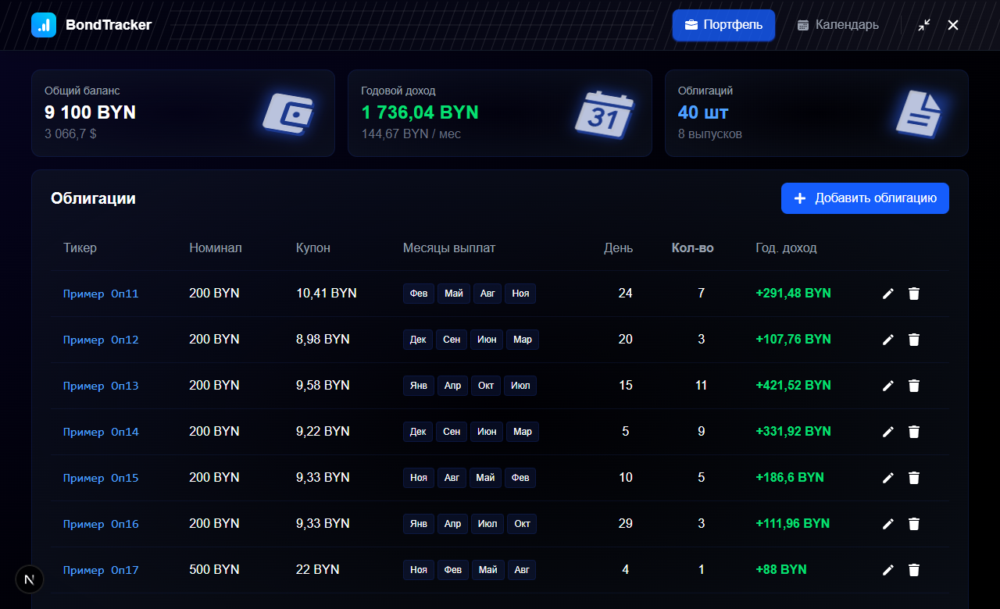

# Bonds Tracked | Client App

Приложение помогает следить за своими инвестициями и контролировать выплаты по ним в понятном календаре. Очень помогает инвесторам, которые пользуются не сильно продвинутыми терминалами для инвестирования.



> Внимание! ~20% Frontend части было написано ИИ, а именно рендер календаря, т.к. я не смог понять как его грамотно сделать. Основной проект фронта был написан очень давно и вообще на Python FastAPI. Я решил переписать проект на GO, изменить дизайн, доработать мелочи, т.к. хотел сделать полноценное приложение, а так-же перейти на golang. Frontend часть не самого чистого качества написания кода. В качестве архитектуры выбрана FSD.

## Стек:

- Golang + Whails
- NEXTjs & React, TypeScript, motion, react-icons

## Установка

1. Если вы в Беларуси и ваша валюта BYN, скачайте релиз справа на GitHub и пользуйтесь.
2. Если ваша валюта другая - **клонируйте репозиторий**

```bash
git clone github.com/XCraiteX/app-bonds-tracker
```

3. Измените валюту в `config.ts`

```ts
// Заменить на свою валюту
export const currency = "BYN";
```

4. Если ваша валюта $ - замените валюту конвертации и формулу. Файл `page.tsx:98`

```tsx
value2={`${(totalBalance * 0.337).toLocaleString("ru-RU")} $`}
```

5. Установите CLI `Wails`, если его у вас нет

```bash
go install github.com/wailsapp/wails/v2/cmd/wails@latest
```

6. Установить `nodejs` пакеты для фронтенда

```bash
cd app/frontend
npm i
```

7. Соберите проект

```bash
wails build --clean
```

8. Ваш `.exe` появится в папке `build/bin/BondsTracker.exe`. Перенесите его куда вам удобно и на уровне с `.exe` создайте папку `database`. Файл `sql.db` будет создан автоматически при запуске.

💝 by. XCraiteX
